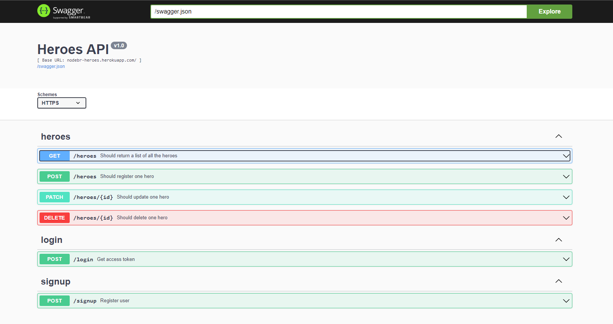

<h1 align="center" id="title">NodeBr - Heroes API</h1>

<p id="description">A multi-database REST API developed with Node js.</p>


<h2>🚀 Demo</h2>

[https://nodebr-heroes.herokuapp.com/documentation#/](https://nodebr-heroes.herokuapp.com/documentation#/)

<h2>Project Screenshots:</h2>



<h2>🧐 Features</h2>

Here're some of the project's best features:

- JWT Authenticatoin
- Request validation with Joi
- Endpoints documentation with Swagger
- Automated tests
- Test coverage with Istanbul
- Pagination

<h2>🛠️ Installation Steps:</h2>

<p>1. Clone the project</p>

```
git clone https://github.com/FranciscoGSilverio/MultiDbNodeJs.git
```

<p>2. Install the dependecies</p>

```
npm install
```

<p>3. Execute the program</p>

```
npm start
```

<h2>💻 Built with</h2>

Technologies used in the project:

- Node.js
- Hapi.js
